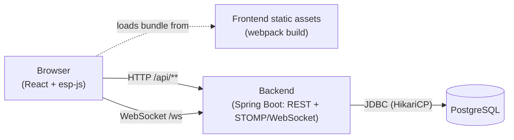

# Architecture

A map of how Paper Desk fits together, for anyone picking up the codebase
who doesn't want to reverse-engineer it from the source tree. For setup
instructions see the root `README.md`; for production account provisioning
see `docs/cd-setup-runbook.md`.

## System overview

Same-origin is load-bearing: `frontend/src/core/ApiClient.ts` makes bare
`fetch('/api/...')` calls and `StompService.ts` builds the WebSocket URL
from `window.location.host`. Nothing in the frontend is configurable with a
different API base URL — the frontend and backend **must** appear to the
browser as the same origin. Dev and prod each satisfy this a different way
(see [Dev vs Prod](#dev-vs-prod-differences) below), which is the single
most important thing to understand about how this app is wired together.

## Components

### Frontend (`frontend/`)
- **esp-js** (not Redux) drives all client state: `esp-js` is the event
  Router, `esp-js-polimer` holds immutable state models
  (`frontend/src/models/*.ts`), `esp-js-react` binds React components to
  model state via `useModelState`, `esp-js-di` wires up the DI container in
  `frontend/src/bootstrap.ts`.
- `frontend/src/core/DataService.ts` is the single place that talks to the
  backend — every REST call and every WebSocket subscription flows through
  it, and every response is re-published back into the Router as an event so
  polimer models (and the DevTools event trace) see every state change
  uniformly, regardless of whether it came from a user action or a server
  push.
- `frontend/src/core/ApiClient.ts` (fetch wrapper, JWT header, error
  surfacing) and `frontend/src/core/StompService.ts` (WebSocket/STOMP
  connection, topic subscriptions) are DataService's two transports.
- `frontend/src/views/*.tsx` are the tab views (Market, Options Chain, FX
  Sales/Trader, Portfolio, Scorecard, Blotter, Progress, Classroom, etc.),
  each reading its slice of state via `useModelState` and dispatching events
  back through DataService.
- `frontend/src/devtools/` is a separate, decoupled event-flow tracer — see
  its own section below since it behaves differently in dev vs prod.

### Backend (`backend/`)
- `com.paperdesk.web` — REST controllers and WebSocket/STOMP config
  (`WebSocketConfig`, topics documented in its class comment:
  `/topic/clock/{sessionId}`, `/topic/prices/{sessionId}`,
  `/topic/account/{accountId}`).
- `com.paperdesk.sim` — the **server-authoritative simulated clock and
  market**: `SimEngine` ticks on a fixed schedule
  (`@Scheduled(fixedRateString = "${paperdesk.sim.tick-millis}")`, gated by
  `paperdesk.sim.auto-tick`), advancing simulated time and regenerating
  prices (GBM) for every active `ScenarioSession`. The client never computes
  prices or time itself — it only ever displays what the server last pushed
  or returned, which is what makes "same seed → same market" and
  synchronized multi-student cohorts possible.
- `com.paperdesk.trading` — `OrderService` (order placement, the simplified
  matching model, position/cash/margin bookkeeping for every instrument
  type) and `PortfolioService` (live valuation, the trader scorecard).
- `com.paperdesk.gamification` — XP/levels/badges, missions, daily streaks;
  all server-evaluated so nothing can be spoofed client-side.
- `com.paperdesk.coach` — the AI trading coach ("explain this trade"):
  `AnthropicClient` is a thin seam over the real Anthropic Messages API call
  (`AnthropicHttpClient`, plain `java.net.http.HttpClient`, no SDK dependency
  needed), `TradingCoachService` builds the grounded prompt from an order's
  own fills/instrument/Greeks/account data and degrades to
  `configured:false` rather than failing startup when `ANTHROPIC_API_KEY`
  isn't set — this is the one service in the app that's optional by design.
- `com.paperdesk.config` — `JwtService`, `SecurityConfig`,
  `StompAuthChannelInterceptor` (topic-level WebSocket authorization),
  `AccountGuard` (per-request "do you own this account" check used at the
  top of every account-scoped controller method).
- `com.paperdesk.domain` / `com.paperdesk.repo` — JPA entities and Spring
  Data repositories; the schema itself lives in Flyway, not
  `ddl-auto` (see [Persistence](#persistence) below).

### DevTools (`frontend/src/devtools/`)
A router-level, framework-agnostic event tracer (bridges to Redux DevTools,
plus a standalone overlay panel opened in its own browser window/process —
see the design note in `README.md`'s DevTools section for why a separate
window instead of an in-page panel or Web Worker). Its activation policy
differs between dev and prod; see below.

## Data flow: two examples

**Placing an order** (`MarketView` → `DataService.placeOrder` →
`POST /api/orders` → `OrderController` → `OrderService.place()` →
`applyFill()` updates `Position`/`Account`/`ClosedTrade` → response returns
the filled `TradeOrder` → `DataService` publishes `orderResultReceived` into
the Router → `TradingModel` updates → `TicketView` re-renders). In parallel,
`OrderService.notifyAccount()` pushes a `FILL` event over
`/topic/account/{accountId}`, which `StompService` turns into an
`accountEventReceived` event — this is how a fill shows up as a toast even
if the tab that placed it isn't the one currently focused, and how
multi-window/multi-device sessions for the same account stay in sync.

**Sim clock tick**: `SimEngine`'s scheduled tick advances `simTime` for
every active session, regenerates the current tick's prices, and broadcasts
both `/topic/clock/{sessionId}` and `/topic/prices/{sessionId}`.
`ClockModel`/`MarketModel` consume these and every view showing a price or
the clock re-renders — the frontend never polls for this, it's push-only
over the same WebSocket connection used for account events.

## Auth & security model

- **JWT** (`JwtService`): HS256, issued on signup/login, contains user id
  (subject), email, role, display name. `JwtAuthFilter` reads the
  `Authorization: Bearer` header on every REST request; `SecurityConfig`
  permits only `/api/auth/**`, `/ws/**`, `/error`, `/actuator/health`
  unauthenticated — everything else requires a valid token.
- **WebSocket auth**: the STOMP handshake itself is unauthenticated at the
  HTTP layer (`/ws/**` is in the permit-list, since the JWT travels inside
  the STOMP `CONNECT` frame instead of an HTTP header), but
  `StompAuthChannelInterceptor` validates the token and authorizes every
  individual topic **subscription** — a student can subscribe to their own
  `/topic/account/{accountId}` but not anyone else's.
- **Passwords**: BCrypt (`SecurityConfig.passwordEncoder()`).
- **Per-request account ownership**: `AccountGuard.owned(accountId)`, called
  at the top of every account-scoped controller method that can mutate
  state (placing/cancelling orders) — a valid JWT alone isn't enough, the
  token's user must actually own the account being queried.
  `AccountGuard.ownedOrInstructing(accountId)` extends this for read-only
  endpoints (grades, trade comments) to also allow the instructor of the
  cohort that account's session belongs to; `requireInstructing(accountId)`
  is the instructor-only variant (grading, student review, posting a
  comment) — an instructor is never authorized to place or cancel a
  student's orders, only to read and grade.

## Persistence

Flyway (`backend/src/main/resources/db/migration`, `V1`–`V8`) owns the
schema; `spring.jpa.hibernate.ddl-auto` is `none` everywhere, dev included
— there's no "let Hibernate figure out the schema" path, so what runs in a
test is exactly what runs in prod. Conventions: `BIGINT GENERATED BY
DEFAULT AS IDENTITY` primary keys, `NUMERIC(19,4)`/`NUMERIC(19,6)` for
money/price columns, `TIMESTAMP` for `Instant` fields, `DATE` for
calendar-day fields (`sim_date`, `expiry_date`). A new migration is a new
`V{n}__description.sql` file — never edit a shipped one (Flyway tracks
checksums).

## Dev vs Prod differences

The single biggest thing to keep in mind: **most of the app's Java/TS code
is identical in both environments.** Nearly everything below is config or
topology, not application logic — a bug reproduced in dev almost always
reproduces in prod and vice versa, with the differences listed here being
the main exception cases worth knowing about.

| Concern | Dev / local | Prod |
|---|---|---|
| **Database** | H2 in-memory, `MODE=PostgreSQL` (`application.yml`) — zero setup, resets on every restart | Real PostgreSQL (Supabase free tier, see `docs/cd-setup-runbook.md`) via `SPRING_DATASOURCE_URL/USERNAME/PASSWORD` |
| **Same-origin strategy** | webpack-dev-server's proxy (`frontend/webpack.config.js` `devServer.proxy`) forwards `/api` and `/ws` to `localhost:8080` | A Cloudflare Worker (`worker/src/index.ts`) routes `/api/**`, `/ws`, `/actuator/health` to the backend Container and everything else to static assets (`[assets]` in `wrangler.toml`) |
| **Backend process** | Plain JVM: `mvn spring-boot:run` | Dockerized fat jar (`backend/Dockerfile`) running inside a Cloudflare Container, `SPRING_PROFILES_ACTIVE=prod` baked into the image |
| **Frontend assets** | webpack-dev-server, unminified, hot module reload | `webpack --mode production` static build (`frontend/dist`), served directly by the Worker's `ASSETS` binding — no server-side rendering or build step at request time |
| **CORS / WebSocket allowed origin** | `paperdesk.cors.allowed-origin` defaults to `*` (wide open) | Must be set via `PAPERDESK_ALLOWED_ORIGIN` to the real public hostname — `WebSocketConfig` uses it directly for `setAllowedOriginPatterns` |
| **JWT secret** | Hardcoded dev placeholder in `application.yml` | Required from `PAPERDESK_JWT_SECRET`; `JwtService` **fails startup** if it's missing, under 32 bytes, or still equal to the dev placeholder while the `prod` profile is active — this is deliberate fail-fast, not a bug, if you see it |
| **Actuator** | Default Spring Boot Actuator exposure (not specially restricted) | `application-prod.yml` explicitly limits exposure to `health` only, `show-details: never` |
| **DevTools** | Always active (`process.env.NODE_ENV === 'development'`) — no opt-in needed | Off by default; code isn't even downloaded until explicitly activated via `?devtools=1`, a persisted prior opt-in, or Ctrl+Shift+E (see `frontend/src/devtools/activation.ts`) — safe to leave shipped in the prod bundle since it's inert until turned on |
| **Migrations** | Flyway runs automatically on every boot, against a schema that resets each time (in-memory H2) | Flyway also runs automatically on every boot, but against a schema that *persists* — the **first** prod deploy should be a manually-triggered `workflow_dispatch` (not an ordinary `main` push) so a human watches the first migration land cleanly on a fresh schema; every deploy after that is safe via Flyway's checksum tracking |
| **Sim clock** | `paperdesk.sim.auto-tick: true` by default, same as prod (only the `test` profile sets it `false`, so tests can step time explicitly) | Same as dev — no difference here, called out just to head off the assumption that there is one |
| **AI trading coach** | `ANTHROPIC_API_KEY` unset by default — the coach reports `configured:false` and the Blotter shows a "not configured" message; nothing else in the app is affected | Same optional behavior — unlike the JWT secret, an unset key does **not** fail startup, only turn the one feature off. Set `ANTHROPIC_API_KEY` (and optionally `PAPERDESK_COACH_MODEL`) whenever you're ready to enable it |

## Where the deployment story stands

The Cloudflare Worker + Container + Supabase topology above (`wrangler.toml`,
`worker/src/index.ts`) is **drafted but unverified against a real Cloudflare
account** — see the `DRAFT` comments in those files and
`docs/cd-setup-runbook.md` §4 for what still needs a live validation pass
before `.github/workflows/cd.yml` gets wired up for automated deploys.
